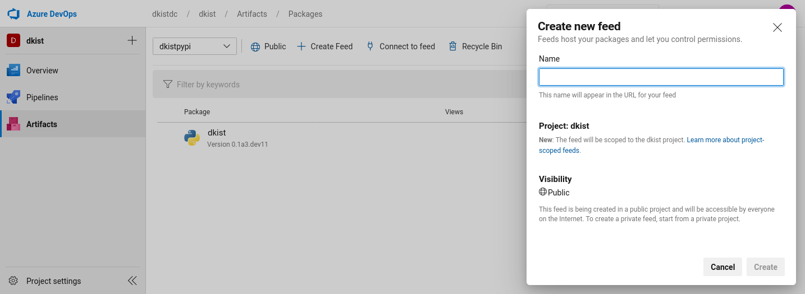

Python package release template
===============================

This template automates the process of building wheels as well as a source
distribution, and uploading them all to PyPI. Your project must be PEP-517 and
PEP-518 compatible in order to use this. Note that you will also need to make
sure you first load the templates as described in :doc:`common`.

Configuring the PyPI service connection
---------------------------------------

If you plan to use this template to upload releases to PyPI, you will need to
first set up a PyPI service connection in Azure. To do this, go to the Azure
configuration for the repository where you want to use the templates. Then
click on **Project Settings** (in the bottom left as of 2019-09-18), then go
to the **Service connections** section in the settings.

Select **New Service Connection**, then **Python Package Upload**, and enter
the following information:

===================================== ========
**Connection Name:**                  a name for the connection, with no spaces, e.g. ``pypi_endpoint``

**Python repository url for upload:** this should be https://upload.pypi.org/legacy/ if you want to push the releases to the main PyPI server. Note that you can also use https://test.pypi.org/legacy/ if you want to test out the process using the Test PyPI server. Be sure to use https://, and include the '/' at the end of the URL since twine will otherwise fail.

**EndpointName**:                     for simplicity, you can set this to be the same as the connection name unless you have a good reason not to.

**Username**:                         this should be either your PyPI (or Test PyPI) username, or ``__token__`` if you want to use token authentication (note that in the latter case you should make sure the 'Username and Password' option is selected, **not** 'Authentication token'!).

**Password:**                         this should be either your PyPI (or Test PyPI) password, or the token if you want to use token authentication.
===================================== ========

If you want to use token authentication, you can create a token in your PyPI (or Test PyPI) settings.

Usage and options
-----------------

To make use of this template, add the following to the ``azure-pipelines.yml`` file:

.. code:: yaml

    jobs:
    - template: publish.yml@OpenAstronomy
      parameters:
        ${{ if startsWith(variables['Build.SourceBranch'], 'refs/tags/v') }}:
          pypi_connection_name: 'pypi_endpoint'
        libraries:
        - libfftw3-dev
        targets:
        - sdist
        - wheels_linux
        - wheels_macos
        - wheels_windows

The ``if`` statement ensures that the wheels are only published for builds that
are triggered by tags - though the wheels will still be built and tested for
other commits.

The ``pypi_connection_name`` entry should be set to the **Connection Name** you
set above. If the endpoint name you set is different from the connection name,
you should also specify the endpoint name with the ``pypi_endpoint_name``
parameter. ``targets`` should be set to a list of builds you want to generate -
the options are:

* ``sdist``: source distribution
* ``wheels_universal``: universal binary wheel for all platforms (which can be used if you have no compiled extensions)
* ``wheels_linux``: binary wheels for Linux
* ``wheels_macos``: binary wheels for MacOS X
* ``wheels_windows``: binary wheels for Windows
* ``wheels_<cibuildwheel_spec>``: A detailed build spec for cibuildwheel (see below).

Finally the ``libraries`` section allow you to pre-install libraries that are required to install the ``sdist`` build.
This can be needed in order to test the built source distribution.
The libraries are installed using the ``apt`` package manager.

In addition to the above YAML, make sure that you include the following
settings, which will allow Azure to run when a tag is pushed to GitHub::

    trigger:
      branches:
        include:
        - '*'
      tags:
        include:
        - 'v*'

If you want to run tests on the generated packages (which we recommend), you can make use of
the following parameters:

.. code:: yaml

    jobs:
    - template: publish.yml@OpenAstronomy
      parameters:
        ${{ if startsWith(variables['Build.SourceBranch'], 'refs/tags/v') }}:
          pypi_connection_name: 'pypi_endpoint'
        test_extras: "all,test"
        test_command: pytest --pyargs sunpy
        targets:
        ...

Here ``test_extras`` is the list of extras_requires options that will be used
when installing the built package for testing - these are options that are
typically specified using the following syntax: ``pip install package[all,test]``.
The ``test_command`` parameter gives a command that will be run in a temporary
directory and has to rely on the installed version of the package (hence the use
of ``--pyargs`` in the example above).

Controlling cibuildwheel
########################

The wheel building process is carried out by `cibuildwheel
<https://github.com/joerick/cibuildwheel>`_, there are two ways to control what
versions of Python and what architectures wheels are built for.

The first way is using the all the environment variables supported by
cibuildwheel. For example, you can place the following at the top of your
``azure-pipelines.yml`` file to force wheels to only be built on Python 3.6 and
3.7, and excluding 32-bit Windows and Linux.

.. code:: yaml

    variables:
      CIBW_BUILD: cp36-* cp37-*
      CIBW_SKIP: "*-win32 *-manylinux1_i686"

The second is that you can configure the ``CIBW_BUILD`` environment variable via
the ``targets`` list. This is particularly useful if you need to split different
architectures over multiple jobs due to timeouts or a desire for faster
completion. To do this you can place any valid option for
`CIBW_BUILD <https://cibuildwheel.readthedocs.io/en/stable/options/#build-skip>`__
after ``wheels_`` in the target list. For example you can setup a manual set of
builds as follows:

.. code:: yaml

    targets:
    - sdist
    - wheels_cp3[78]-manylinux*
    - wheels_cp38-macosx_x86_64
    - wheels_cp37-macosx_x86_64
    - wheels_cp3?-win32
    - wheels_cp3?-win_amd64

You can also combine these specifications with the simple OS specifications, for
those simple builds the ``CIBW_BUILD`` environment variable will not be set
allowing you to set the defaults as above.

The only restriction on this is that the specification must contain one of
``win``, ``macos`` or ``linux`` to be able to select the operating system
image to use.

Jupyter widget packages
-----------------------

Packages that implement widgets for the Jupyter ecosystem also need to be built
and published on https://www.npmjs.com/ - to do this, you will first need to add
an npm service connection in Azure, which we will call ``npm_endpoint`` here (as
for PyPI, you can use this for both the connection name and endpoint name).

Once this is set up, you can include ``npm_connection_name`` alongside
``pypi_connection_name``, you can add ``npm`` as a target, and you can optionally
specify the directory in which to run the ``npm install`` and ``npm publish``
commands using the ``npm_dir`` option (this defaults to the root of the repository):

.. code:: yaml

    jobs:
    - template: publish.yml@OpenAstronomy
      parameters:
        ${{ if startsWith(variables['Build.SourceBranch'], 'refs/tags/v') }}:
          pypi_connection_name: 'pypi_endpoint'
          npm_connection_name: 'npm_endpoint'
        npm_dir: 'js'
        targets:
          - npm
          ...

Publishing to Azure Artifacts
-----------------------------

The publish template can also publish wheels and sdists to `Azure Artifacts <https://docs.microsoft.com/en-us/azure/devops/pipelines/artifacts/pypi>`__.
This is useful for generating "nightly" wheels for use on other CI jobs etc.

To get started with this, you first need to create a feed in Azure Artifacts.
If you want to make this feed public, so that unauthenticated users can access it, it needs to be a "project scoped" feed, which is now the default, and the visibility needs to be set to "public".

   Creating a public, project scoped feed in Azure.

To upload to Azure Artifacts rather than PyPI, you specify the ``artifact_feed`` and ``artifact_project`` variables instead of ``pypi_connection_name``.

If you wish to upload on all builds on master you would add a section to the ``publish.yml`` config which looks like:

.. code:: yaml

    jobs:
    - template: publish.yml@OpenAstronomy
      parameters:
        ${{ if eq(variables['Build.SourceBranchName'], 'master') }}:
          artifact_project : 'projectname'
          artifact_feed : 'feedname'
        ...

This can be combined with the sections described above to upload to PyPI on tags or other conditions.

Another option is to combine artifact uploads with scheduled (cron) builds, to upload every night, or other schedule:

.. code:: yaml

    jobs:
    - template: publish.yml@OpenAstronomy
      parameters:
        ${{ if (variables['Build.Reason'], 'Schedule') }}:
          artifact_project : 'projectname'
          artifact_feed : 'feedname'
        ...

see the documentation on `scheduled triggers <https://docs.microsoft.com/en-us/azure/devops/pipelines/process/scheduled-triggers>`__ for details on configuring cron builds on Azure.

Using Artifacts with pip
########################

To use the artifacts after uploading you need to specify ``--extra-index-url`` to pip, or add it to the pip config file.

You can get instructions specific to your artifacts feed by clicking the "Connect to Feed" option in the Azure UI.
The form of the URL is (at the time of writing) ``https://pkgs.dev.azure.com/<organizationname>/<projectname>/_packaging/<feedname>/pypi/simple/``.

So an example pip command would be ``pip install --extra-index-url https://pkgs.dev.azure.com/sunpy/sunpy/_packaging/sunpy/pypi/simple/ sunpy``.

Development Packages and ``setuptools_scm``
-------------------------------------------

If you are using setuptools_scm in its default configuration and wish to push non-tagged releases to Azure Artifacts (or PyPI) you will need to remove the "local" version component from the version number before building wheels or sdists.
This is because local version strings are not supported for upload to PyPI or Azure artifacts.
This, by default, is the section of the version number after the ``+``, which is normally the git hash.
The template can remove this section of the version number for you by setting the ``remove_local_scheme: true`` variable.
Using this your config block would look like:

.. code:: yaml

    jobs:
    - template: publish.yml@OpenAstronomy
      parameters:
        ${{ if eq(variables['Build.SourceBranchName'], 'master') }}:
          artifact_project : 'projectname'
          artifact_feed : 'feedname'
          remove_local_scheme: true
        ...

This is implemented by stripping all the characters in the version number after the ``+``.
